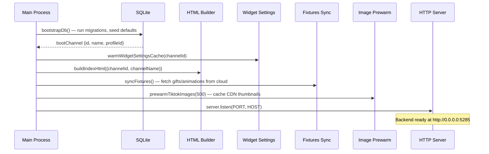
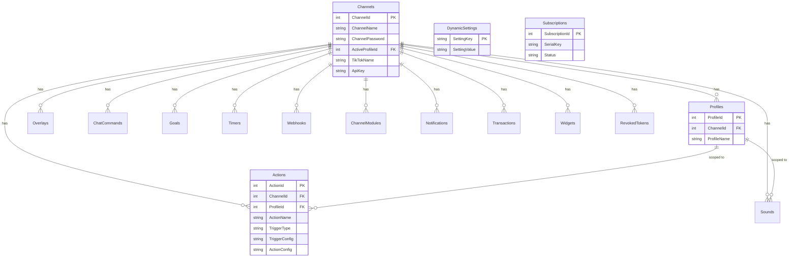
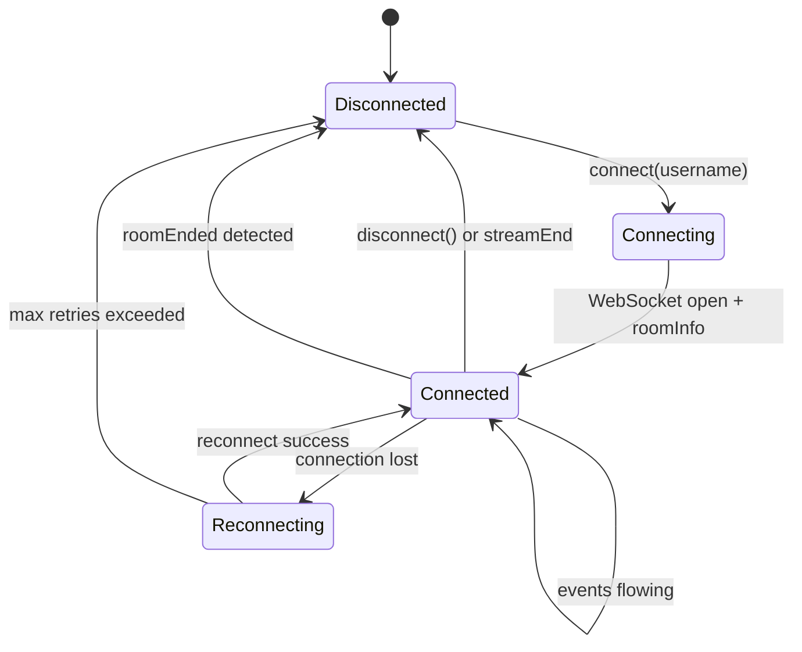
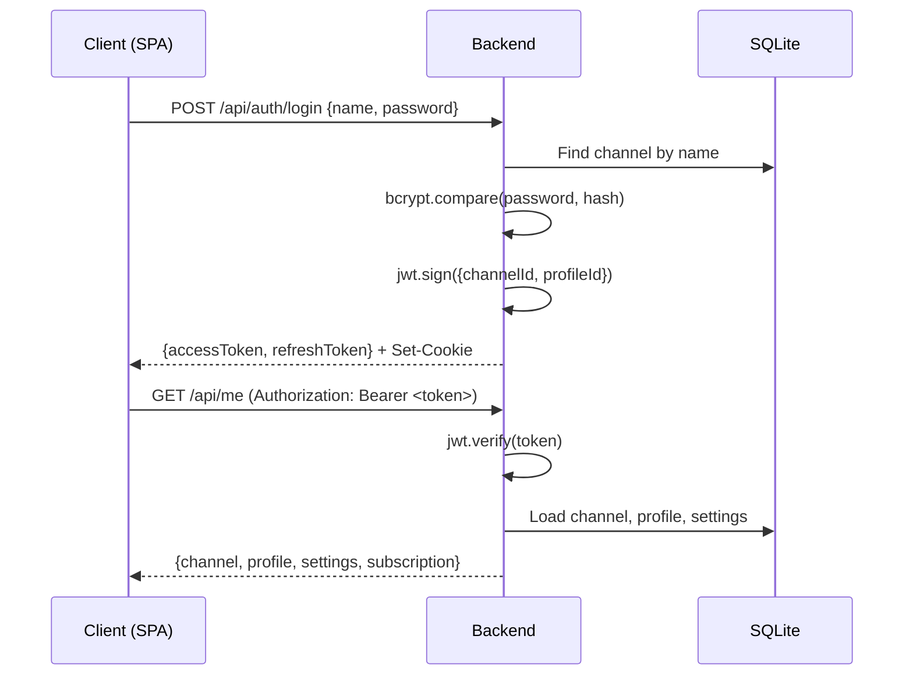
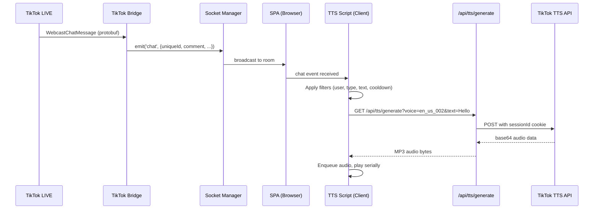
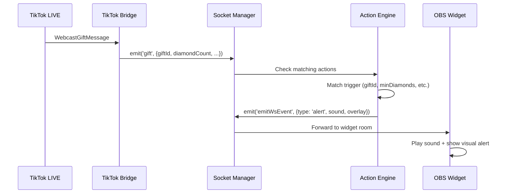
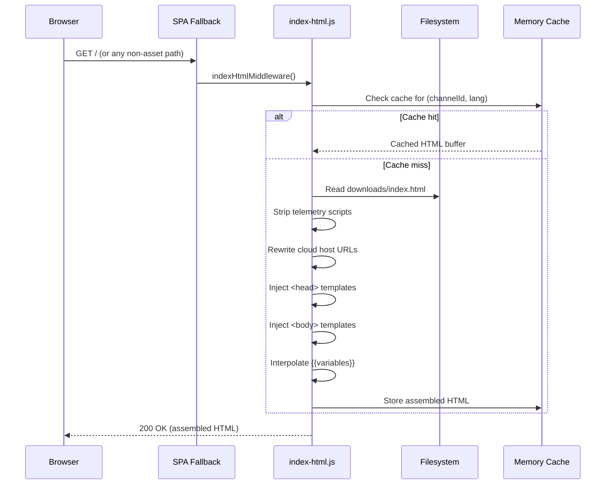

# TikPro Backend Architecture

> Node.js backend for TikPro Desktop — a self-hosted clone of TikFinity that serves the
> bundled TikFinity SPA, handles TikTok LIVE event streaming, manages user state, and
> exposes real-time Socket.IO + REST APIs for overlays, widgets, TTS, and OBS integration.

---

## Table of Contents

1. [High-Level Overview](#1-high-level-overview)
2. [Technology Stack](#2-technology-stack)
3. [Project Structure](#3-project-structure)
4. [Configuration & Environment](#4-configuration--environment)
5. [Boot Sequence](#5-boot-sequence)
6. [Database Layer](#6-database-layer)
7. [Services Layer](#7-services-layer)
8. [REST API Routes](#8-rest-api-routes)
9. [Middleware](#9-middleware)
10. [Template Injection System](#10-template-injection-system)
11. [Real-Time Layer (Socket.IO)](#11-real-time-layer-socketio)
12. [TikTok LIVE Bridge](#12-tiktok-live-bridge)
13. [Widget & Overlay System](#13-widget--overlay-system)
14. [TTS (Text-to-Speech)](#14-tts-text-to-speech)
15. [Authentication & Authorization](#15-authentication--authorization)
16. [Electron Integration](#16-electron-integration)
17. [Proxy & Network Layer](#17-proxy--network-layer)
18. [Data Flow Diagrams](#18-data-flow-diagrams)

---

## 1. High-Level Overview

```
┌─────────────────────────────────────────────────────────────────┐
│                     Electron Main Process                       │
│  ┌──────────┐  ┌──────────┐  ┌──────────┐  ┌────────────────┐ │
│  │  Splash  │  │  Main    │  │  TikTok  │  │ Desktop API WS │ │
│  │  Window  │  │  Window  │  │  Login   │  │  :21213        │ │
│  └──────────┘  └──────────┘  └──────────┘  └────────────────┘ │
│        │              │              │              │           │
│        └──────────────┴──────────────┘              │           │
│                       │ http://localhost:5285        │           │
└───────────────────────┼─────────────────────────────┼───────────┘
                        │                             │
┌───────────────────────▼─────────────────────────────▼───────────┐
│                    Node.js Backend (:5285)                       │
│                                                                  │
│  ┌──────────┐  ┌──────────┐  ┌──────────┐  ┌────────────────┐  │
│  │ Express  │  │Socket.IO │  │ TikTok   │  │  Static Files  │  │
│  │  REST    │  │ Real-Time│  │  Bridge  │  │  (SPA Bundle)  │  │
│  │  API     │  │  Events  │  │  (Live)  │  │                │  │
│  └────┬─────┘  └────┬─────┘  └────┬─────┘  └────────────────┘  │
│       │              │              │                             │
│  ┌────▼──────────────▼──────────────▼─────┐                      │
│  │          SQLite (better-sqlite3)        │                      │
│  │  WAL mode · FK enforced · Sync access  │                      │
│  └────────────────────────────────────────┘                      │
└──────────────────────────────────────────────────────────────────┘
```

The backend is a **monolithic Express + Socket.IO server** that:

- **Serves** the TikFinity SPA bundle (pre-built HTML/JS/CSS from `downloads/`)
- **Injects** custom scripts, CSS, and auth shims into the HTML at serve-time
- **Bridges** TikTok LIVE events via `tiktok-live-connector` (Eulerstream WebSocket)
- **Broadcasts** events (chat, gifts, likes, follows) over Socket.IO to connected clients
- **Stores** user configuration, actions, profiles, sounds, and widget settings in SQLite
- **Proxies** TikTok CDN images, TTS audio, and MyInstants sound effects
- **Integrates** with OBS via `obs-websocket-js` for scene/source control

---

## 2. Technology Stack

| Category | Technology | Purpose |
|----------|-----------|---------|
| Runtime | Node.js ≥ 20 | Server runtime |
| Framework | Express 4 | HTTP REST API |
| Real-time | Socket.IO 4 | WebSocket event broadcasting |
| Database | SQLite via `better-sqlite3` | Persistent storage (synchronous) |
| Migrations | Knex 3 | Schema migrations |
| Auth | `jsonwebtoken` (JWT) | Token-based auth |
| TikTok | `tiktok-live-connector` 2.x | TikTok LIVE WebSocket bridge |
| OBS | `obs-websocket-js` 5 | OBS Studio integration |
| Logging | Pino + pino-pretty | Structured logging |
| Validation | Zod | Request validation |
| File Upload | Multer | Multipart form data |
| Passwords | bcryptjs | Password hashing |
| HTTP Client | Axios + native fetch | Outbound requests |
| WebSocket | ws | Raw WebSocket support |

---

## 3. Project Structure

```
backend-node/
├── package.json              # Dependencies & scripts
├── knexfile.js               # Knex migration config
├── scripts/                  # Dev utilities & analysis scripts
│   ├── extract-templates.js  # Extracts injection templates from bundle
│   ├── extract-new-i18n.js   # Extracts missing i18n keys
│   └── ...                   # Various debugging/inspection scripts
│
└── src/
    ├── index.js              # ★ Main entry — Express app, routes, proxies, boot
    ├── config.js             # Centralised config (port, host, paths, secrets)
    ├── logger.js             # Pino logger factory
    │
    ├── db/
    │   ├── conn.js           # Singleton better-sqlite3 connection
    │   ├── seed.js           # Initial data seeding
    │   ├── migrations/       # Knex schema migrations
    │   │   ├── 20260515000001_initial.js
    │   │   ├── 20260526000001_revoked_tokens_fk.js
    │   │   └── 20260526000002_composite_profile_indexes.js
    │   └── models/           # Data access layer (18 model files)
    │       ├── channels.js   # Channel CRUD + profile switching
    │       ├── actions.js    # Event-triggered actions
    │       ├── profiles.js   # Multi-profile support
    │       ├── widgets.js    # Widget configurations
    │       ├── sounds.js     # Sound alert management
    │       ├── goals.js      # Goal tracking
    │       └── ...           # (13 more model files)
    │
    ├── services/             # Business logic layer (11 service files)
    │   ├── tiktok-bridge.js  # ★ TikTok LIVE connection manager (~53KB)
    │   ├── socket-manager.js # ★ Socket.IO event hub (~21KB)
    │   ├── aggregates.js     # Live viewer/gift/chat statistics
    │   ├── chat-bot.js       # Auto-reply chat bot
    │   ├── jwt.js            # JWT sign/verify/refresh
    │   ├── points.js         # Viewer points system
    │   ├── webhooks.js       # Outbound webhook dispatcher
    │   ├── widget-defaults.js       # Default widget configs
    │   ├── widget-settings-cache.js # In-memory settings cache
    │   ├── bundle-fixtures-sync.js  # Sync gifts/animations from cloud
    │   └── tiktok-image-prewarm.js  # CDN image cache warming
    │
    ├── routes/               # Express route handlers (24 route files)
    │   ├── me.js             # /api/me — user session & settings (~22KB)
    │   ├── widget.js         # /api/widget — overlay configs (~15KB)
    │   ├── data.js           # /api/data — logs, leaderboards (~15KB)
    │   ├── actions.js        # /api/actions — event actions (~13KB)
    │   ├── auth.js           # /api/auth — login/register/logout
    │   ├── tiktok.js         # /api/tiktok — connect/disconnect/status
    │   ├── tts.js            # /api/tts — text-to-speech proxy
    │   ├── settings.js       # /api/settings — bundle settings
    │   ├── obs.js            # /api/obs — OBS WebSocket bridge
    │   └── ...               # (15 more route files)
    │
    ├── middleware/
    │   ├── auth.js           # JWT verification middleware
    │   ├── index-html.js     # ★ HTML template injection engine (~18KB)
    │   └── spa-fallback.js   # SPA route catch-all
    │
    └── templates/            # Injected scripts/styles (16 files, ~550KB total)
        ├── blockScript.txt   # ★ Master injection script (~243KB)
        ├── i18n-patch.json   # Missing i18n translations (~131KB)
        ├── loginPopupScript.txt  # Login modal UI
        ├── earlyCss.txt      # CSS overrides & theme
        ├── authScript.txt    # Auth token bootstrap
        ├── ttsScript.txt     # Client-side TTS engine
        ├── ttsVoiceShim.txt  # TTS URL rewriting
        ├── reloadGuard.txt   # Prevents unwanted page reloads
        ├── voice-catalog.json    # TTS voice list
        └── ...               # (7 more template files)
```

---

## 4. Configuration & Environment

**File:** `src/config.js`

All configuration is centralised in a single module. Values are resolved from
environment variables with sensible defaults for development:

| Key | Default | Description |
|-----|---------|-------------|
| `PORT` | `5285` | HTTP server port |
| `HOST` | `0.0.0.0` | Bind address (all interfaces for LAN access) |
| `FRONTEND_PATH` | `../../downloads` | Path to SPA bundle |
| `DATA_DIR` | `%APPDATA%/tikfinity-desktop` | User data directory |
| `DB_PATH` | `<DATA_DIR>/tikfinity.db` | SQLite database file |
| `AUTH_HOST` | `https://tikpr0.com` | Cloud auth server |
| `JWT_SECRET` | Auto-generated | Per-install secret (persisted to `<DATA_DIR>/jwt-secret`) |
| `SIGN_API_KEY` | *(empty)* | Eulerstream paid tier API key |
| `LOG_LEVEL` | `info` | Pino log level |

**JWT Secret Resolution:**
1. Explicit `TIKMAX_JWT_SECRET` env var → use it
2. Production mode → generate a crypto-random 48-byte secret, persist to `<DATA_DIR>/jwt-secret`
3. Development mode → use hardcoded dev-only fallback

---

## 5. Boot Sequence

**File:** `src/index.js` (async IIFE at bottom)



**Steps in order:**
1. **Database bootstrap** — Run Knex migrations, seed default channel/profile/actions
2. **Widget settings warm** — Load all widget settings into in-memory cache
3. **HTML pre-build** — Assemble the injected index.html (cached in memory)
4. **Fixtures sync** — Background fetch of gift catalog + animations from cloud
5. **Image prewarm** — Pre-cache 500 TikTok CDN gift/avatar images
6. **Server listen** — Start accepting HTTP + WebSocket connections

---

## 6. Database Layer

### 6.1 Connection

**File:** `src/db/conn.js`

- **Engine:** `better-sqlite3` (synchronous, single-writer)
- **Pragmas:** WAL mode, foreign keys ON, synchronous NORMAL, 5s busy timeout
- **Pattern:** Singleton connection shared across all modules

### 6.2 Schema (17 tables)

**Migration:** `src/db/migrations/20260515000001_initial.js`



### 6.3 Key Tables

| Table | Purpose | Key Columns |
|-------|---------|-------------|
| `Channels` | User accounts/channels | ChannelName, ChannelPassword, TikTokName, ActiveProfileId, ApiKey |
| `Profiles` | Configuration profiles per channel | ProfileName, ChannelId |
| `Actions` | Event-triggered actions (play sound, show overlay, etc.) | TriggerType, TriggerConfig, ActionConfig, ProfileId |
| `Sounds` | Sound alert files & metadata | SoundName, FileName, Volume, ProfileId |
| `Overlays` | Overlay/widget configurations | OverlayName, OverlayType, OverlayConfig |
| `ChatCommands` | Custom chat command definitions | Command, Response, Cooldown |
| `Goals` | Streaming goals (followers, gifts) | GoalType, GoalTarget, GoalCurrent |
| `Widgets` | Per-widget settings (chat, alerts, etc.) | WidgetType, Settings (JSON) |
| `Timers` | Scheduled actions | TimerName, IntervalSeconds |
| `Webhooks` | Outbound webhook endpoints | Url, Events, Secret |
| `Notifications` | In-app notification history | Message, Type, ReadAt |
| `Transactions` | Point transactions | UserId, Amount, Reason |
| `DynamicSettings` | Key-value settings store | SettingKey, SettingValue |
| `Subscriptions` | License/serial key management | SerialKey, Status, ExpiresAt |
| `RevokedTokens` | Invalidated JWT tokens | TokenJti, ChannelId, ExpiresAt |
| `ChannelModules` | Feature toggles per channel | ModuleName, Enabled |

### 6.4 Models (Data Access Layer)

**Directory:** `src/db/models/`

Each model file exports a set of prepared-statement-backed functions for its
table. Pattern:

```javascript
// Example: models/channels.js
const db = require('../conn');

const findById = db.prepare('SELECT * FROM Channels WHERE ChannelId = ?');
const findByName = db.prepare('SELECT * FROM Channels WHERE ChannelName = ? COLLATE NOCASE');
// ...

module.exports = {
  findById: (id) => findById.get(id),
  findByName: (name) => findByName.get(name),
  create: (data) => { /* INSERT + return lastInsertRowid */ },
  update: (id, data) => { /* UPDATE */ },
  // ...
};
```

**Key model responsibilities:**
- **channels.js** — Channel CRUD, profile switching, TikTok name binding, API key rotation
- **profiles.js** — Multi-profile management, cloning profiles with all child records
- **actions.js** — CRUD for event-triggered actions, bulk import/export
- **dynamic-settings.js** — Generic key-value store with `get(key)` / `set(key, value)` / `getMany(keys)`

---

## 7. Services Layer

**Directory:** `src/services/`

Services encapsulate business logic and are consumed by routes and the Socket.IO layer.

### 7.1 TikTok Bridge (`tiktok-bridge.js` — 53KB)

The largest and most critical service. Manages the full lifecycle of connecting to
a TikTok LIVE stream via Eulerstream's WebSocket protocol.

**Key responsibilities:**
- Connect/disconnect to TikTok LIVE rooms by username
- Handle room info fetching, status polling (live/ended detection)
- Translate TikTok protobuf events into normalized JSON
- Emit events to Socket.IO: `chat`, `gift`, `like`, `follow`, `share`, `subscribe`, `roomUser`, `streamEnd`
- Auto-reconnect with exponential backoff
- Detect room-ended state (status=4 or past finish_time) and auto-disconnect
- Support both free-tier and paid-tier (SIGN_API_KEY) Eulerstream connections

**Connection lifecycle:**
```
connect(username) → fetchRoomInfo() → WebSocket handshake
    → event loop (chat/gift/like/...) → broadcast via SocketManager
    → streamEnd detected → disconnect() → cleanup
```

### 7.2 Socket Manager (`socket-manager.js` — 21KB)

Central Socket.IO event hub that manages all real-time communication.

**Architecture:**
- Maintains a map of connected clients by `appType` (controlpage, widget, overlay)
- Each client joins a channel-specific room on `setContext`
- Relays TikTok events from the bridge to connected clients
- Handles `distributeEvent` for cross-client event forwarding
- Manages widget-specific event routing

**Key events emitted:**
| Event | Direction | Description |
|-------|-----------|-------------|
| `chat` | Server→Client | TikTok chat message |
| `gift` | Server→Client | Gift received |
| `like` | Server→Client | Likes received |
| `follow` | Server→Client | New follower |
| `share` | Server→Client | Stream shared |
| `subscribe` | Server→Client | New subscriber |
| `roomUser` | Server→Client | Viewer count update |
| `streamEnd` | Server→Client | Stream ended |
| `status` | Server→Client | Connection status change |
| `setContext` | Client→Server | Set channel context |
| `distributeEvent` | Client→Server | Forward event to other clients |
| `emitWsEvent` | Server→Client | Widget/overlay event |

### 7.3 Other Services

| Service | Purpose |
|---------|---------|
| **aggregates.js** | Computes live statistics: total viewers, unique chatters, gift count, top gifters leaderboard, chat rate. Maintains in-memory counters reset on new stream. |
| **chat-bot.js** | Pattern-matching auto-reply bot. Matches incoming chat against configured commands (prefix/exact/regex) and sends response via TikTok chat API or overlay. |
| **jwt.js** | JWT lifecycle: `sign(payload)`, `verify(token)`, `refresh(token)`, `revoke(jti)`. Uses HS256 with per-install secret. Access tokens expire in 24h, refresh tokens in 30d. |
| **points.js** | Viewer loyalty points. Awards points per chat message (configurable rate). Tracks balances in `Transactions` table. Supports manual add/deduct/reset. |
| **webhooks.js** | Dispatches HTTP POST to configured webhook URLs on events (gift, follow, etc.). Includes HMAC signature for verification. Retries with exponential backoff. |
| **widget-defaults.js** | Returns default configuration objects for each widget type (chat, alerts, goals, sub-goals, emote-wall, etc.). ~18KB of structured defaults. |
| **widget-settings-cache.js** | In-memory LRU-style cache for widget settings. Warm on boot, invalidate on settings update. Avoids DB reads on every widget page load / Socket.IO handshake. |
| **bundle-fixtures-sync.js** | On boot, fetches gift catalog + animation catalog + widget JS files from `AUTH_HOST` cloud server. Falls back to local files on failure. |
| **tiktok-image-prewarm.js** | Pre-fetches TikTok CDN gift/avatar thumbnails into the local proxy cache. Runs at boot with configurable concurrency (10 parallel). |

---

## 8. REST API Routes

**Directory:** `src/routes/`

All routes are mounted under `/api/` in `index.js`. Authentication is enforced
via the `requireAuth` middleware on most endpoints.

### 8.1 Core API Endpoints

#### `/api/me` — Session & User State
The central endpoint for the SPA. Returns the full user context.

| Method | Path | Auth | Description |
|--------|------|------|-------------|
| GET | `/api/me` | ✓ | Full session state: channel, profile, settings, subscription |
| POST | `/api/me` | ✓ | Update settings (bulk key-value) |
| GET | `/api/me/channel` | ✓ | Channel info only |
| POST | `/api/me/settings` | ✓ | Save bundle settings blob |

#### `/api/auth` — Authentication
| Method | Path | Auth | Description |
|--------|------|------|-------------|
| POST | `/api/auth/login` | ✗ | Login with channel name + password |
| POST | `/api/auth/register` | ✗ | Create new channel |
| POST | `/api/auth/logout` | ✓ | Invalidate current token |
| POST | `/api/auth/refresh` | ✗ | Refresh access token |

#### `/api/tiktok` — TikTok LIVE Connection
| Method | Path | Auth | Description |
|--------|------|------|-------------|
| POST | `/api/tiktok/connect` | ✓ | Connect to a TikTok LIVE stream |
| POST | `/api/tiktok/disconnect` | ✓ | Disconnect from stream |
| GET | `/api/tiktok/status` | ✓ | Current connection status |
| GET | `/api/tiktok/roomInfo` | ✓ | Current room metadata |

#### `/api/actions` — Event Actions
| Method | Path | Auth | Description |
|--------|------|------|-------------|
| GET | `/api/actions` | ✓ | List all actions (for current profile) |
| POST | `/api/actions` | ✓ | Create action |
| PUT | `/api/actions/:id` | ✓ | Update action |
| DELETE | `/api/actions/:id` | ✓ | Delete action |
| POST | `/api/actions/test` | ✓ | Test-fire an action |
| POST | `/api/actions/import` | ✓ | Bulk import actions |
| GET | `/api/actions/export` | ✓ | Export all actions as JSON |

#### `/api/widget` — Widget & Overlay Settings
| Method | Path | Auth | Description |
|--------|------|------|-------------|
| GET | `/api/widget/:type` | ✓ | Get widget settings by type |
| POST | `/api/widget/:type` | ✓ | Update widget settings |
| GET | `/api/widget/:type/defaults` | ✓ | Get default settings |
| POST | `/api/widget/:type/reset` | ✓ | Reset to defaults |

### 8.2 Content & Data

#### `/api/data` — Logs, Leaderboards, Analytics
| Method | Path | Auth | Description |
|--------|------|------|-------------|
| GET | `/api/data/chatlog` | ✓ | Chat history |
| GET | `/api/data/giftlog` | ✓ | Gift history |
| GET | `/api/data/leaderboard` | ✓ | Top gifters/chatters |
| POST | `/api/logError` | ✗ | Client error telemetry (discarded) |
| GET | `/api/data/getAllGifts` | ✗ | Gift catalog |
| GET | `/api/data/getAllAnimations` | ✗ | Animation catalog |

#### `/api/sounds` — Sound Alerts
| Method | Path | Auth | Description |
|--------|------|------|-------------|
| GET | `/api/sounds` | ✓ | List all sounds |
| POST | `/api/sounds` | ✓ | Create sound |
| DELETE | `/api/sounds/:id` | ✓ | Delete sound |

#### `/api/tts` — Text-to-Speech
| Method | Path | Auth | Description |
|--------|------|------|-------------|
| GET | `/api/tts/generate` | ✗ | Generate TTS audio (TikTok API proxy) |
| POST | `/api/tts/auth-token` | ✗ | Mint fake JWT for AI voice catalog |

### 8.3 Configuration & Management

#### `/api/settings` — Bundle Settings Persistence
| Method | Path | Auth | Description |
|--------|------|------|-------------|
| GET | `/api/settings` | ✓ | Get all settings |
| POST | `/api/settings` | ✓ | Save settings |
| POST | `/api/updateSettings` | ✓ | Legacy update endpoint |

#### `/api/obs` — OBS Integration
| Method | Path | Auth | Description |
|--------|------|------|-------------|
| POST | `/api/obs/connect` | ✓ | Connect to OBS WebSocket |
| POST | `/api/obs/disconnect` | ✓ | Disconnect from OBS |
| GET | `/api/obs/status` | ✓ | OBS connection status |
| GET | `/api/obs/scenes` | ✓ | List OBS scenes |
| GET | `/api/obs/sources` | ✓ | List OBS sources |

#### `/api/backup` — Backup & Restore
| Method | Path | Auth | Description |
|--------|------|------|-------------|
| GET | `/api/backup/export` | ✓ | Export full backup (JSON) |
| POST | `/api/backup/import` | ✓ | Import backup |

#### Other Routes
| Base Path | Description |
|-----------|-------------|
| `/api/commands` | Chat command CRUD |
| `/api/goals` | Goal tracking CRUD |
| `/api/notifications` | Notification management |
| `/api/points` | Points system management |
| `/api/webhooks` | Webhook CRUD |
| `/api/upload` | File uploads (sounds, images) |
| `/api/config` | Frontend configuration |
| `/api/pro` | Pro/subscription status |
| `/api/key` | Serial key validation |
| `/api/reset` | Factory reset |
| `/api/seed` | Re-seed default data |
| `/api/import-actions` | Bulk action import |
| `/api/tikfinity-import` | Import from original TikFinity |

### 8.4 Inline Routes (in `index.js`)

Several routes are defined directly in the main `index.js` file rather than
in separate route files:

| Method | Path | Description |
|--------|------|-------------|
| GET | `/api/health` | Health check (returns `{status: "ok"}`) |
| GET | `/api/tiktok/status` | TikTok bridge status (inline duplicate) |
| GET | `/api/getAllGifts` | Gift catalog proxy |
| GET | `/api/getAllAnimations` | Animation catalog proxy |
| GET | `/tiktok-image/*` | TikTok CDN image proxy with caching |
| GET | `/tf-assets/*` | TikFinity CDN asset proxy |
| GET | `/myinstants-proxy/*` | MyInstants sound effect proxy |
| GET | `/api/_dev/reload-html` | Dev: invalidate HTML cache |
| POST | `/api/_dev/clientlog` | Dev: receive client-side logs |
| GET | `/widget/*` | Widget/overlay page serving |

---

## 9. Middleware

### 9.1 Auth Middleware (`middleware/auth.js`)

JWT-based authentication using Bearer tokens from the `Authorization` header
or `accessToken` cookie.

```javascript
// Extracts token from:
// 1. Authorization: Bearer <token>
// 2. Cookie: accessToken=<token>
//
// On success: sets req.user = { channelId, profileId, ... }
// On failure: returns 401 Unauthorized
```

### 9.2 CORS (`index.js`)

Dynamic CORS that allows:
- Loopback addresses (`localhost`, `127.0.0.1`, `::1`)
- Same-origin requests (matching `Host` header)
- Private network IPs (`10.x.x.x`, `192.168.x.x`, `172.16-31.x.x`)
- Link-local IPv6 (`fe80::`)

External origins are blocked to prevent CSRF attacks.

### 9.3 SPA Fallback (`middleware/spa-fallback.js`)

Catches all non-API, non-asset GET requests and serves the injected `index.html`.
Recognises asset extensions (`.js`, `.css`, `.png`, `.woff2`, etc.) and skips
them to allow Express static middleware to handle file serving.

---

## 10. Template Injection System

**File:** `middleware/index-html.js`

The most architecturally unique feature. At serve-time, the backend reads the
TikFinity SPA's `index.html` from `downloads/` and **injects** custom scripts
and styles to make the commercial bundle work in our self-hosted environment.

### 10.1 Injection Order

```
<head>
  ├── reloadGuard.txt      — Patches Location.prototype.reload to prevent unwanted reloads
  ├── earlyCss.txt         — CSS overrides (theme, layout fixes, branding)
  ├── blockScript.txt      — ★ MEGA injection (~243KB): API mocking, URL rewriting,
  │                           telemetry blocking, fetch/XHR interceptors, i18n patching,
  │                           voice catalog mocking, TTS queue fixes, AI TTS auth seeding
  └── authScript.txt       — Auth token bootstrap, session.me population
</head>
<body class="tf-logged-out">
  ├── ttsVoiceShim.txt     — Redirects tikfinity-tts-api.zerody.one → local /api/tts/generate
  ├── guestTopbar.txt      — Guest user top bar UI
  ├── loginPopupScript.txt — Login modal implementation
  ├── tiktokConnectScript.txt — Loads tf-connect.js (TikTok bridge client)
  ├── ttsScript.txt        — Client-side TTS engine (queue, playback, filters)
  ├── twemojiScript.txt    — Emoji rendering
  ├── tiktokSigninGate.txt — TikTok sign-in requirement gate
  └── reloadMask.txt       — Loading overlay during reloads
</body>
```

### 10.2 What `blockScript.txt` Does (243KB)

This is the largest and most complex template. It contains a collection of IIFEs
(Immediately Invoked Function Expressions) that:

1. **Block telemetry** — Strips PostHog, Sentry, Google Tag Manager, ContentSquare
2. **Rewrite URLs** — Redirects cloud API calls to local backend
3. **Mock fetch/XHR** — Intercepts `window.fetch` and `XMLHttpRequest` to:
   - Return local voice catalog for `tts.tikfinity.com/api/tts/voices`
   - Return mock user quota for `tts.tikfinity.com/api/tts/user`
   - Return sample audio for `tts.tikfinity.com/api/tts/preview`
   - Block `settings.restore()` calls that would reset user settings
4. **Seed auth tokens** — Injects `window.token`, `window.ttsAuthToken`, `window.appConfig.ttsHost`
5. **Patch i18n** — Merges missing translation keys from `i18n-patch.json`
6. **Fix TTS queue** — Prevents AI-voice head-of-line blocking in the TTS queue
7. **Feed chat to TTS** — Creates a dedicated Socket.IO connection for TTS chat feed
8. **Block script loading** — Prevents loading of blocked third-party scripts via
   `Node.prototype.appendChild` / `insertBefore` / `HTMLScriptElement.src` setter hooks

### 10.3 Language Support

The injection system supports multi-language by:
1. Reading pre-localized HTML files from `downloads/<lang>` (e.g., `downloads/vi`)
2. For languages without a dedicated HTML file, injecting the JSON locale bucket
   from `downloads/config/localization/<lang>.json` into `tfPageloadData.localization`

### 10.4 Template Variables

Templates use `{{variable}}` placeholders interpolated at build time:

| Variable | Source | Used In |
|----------|--------|---------|
| `defaultChannelId` | Boot channel ID | authScript |
| `defaultChannelName` | Boot channel name | authScript |
| `tfConnectVersion` | File mtime of `tf-connect.js` | tiktokConnectScript |
| `i18nPatchJson` | Contents of `i18n-patch.json` | blockScript |
| `voiceCatalogJson` | Contents of `voice-catalog.json` | blockScript |

---

## 11. Real-Time Layer (Socket.IO)

### 11.1 Server Configuration

```javascript
const io = new IoServer(server, {
  cors: { origin: true, credentials: true },
});
```

### 11.2 Client Types

Connected clients identify themselves via `setContext`:

| `appType` | Description |
|-----------|-------------|
| `controlpage` | Main SPA dashboard |
| `widget` | Overlay/widget in OBS browser source |
| `overlay` | Standalone overlay window |

### 11.3 Event Flow

```
TikTok LIVE WebSocket
        │
        ▼
   TikTok Bridge
   (tiktok-bridge.js)
        │ normalised events
        ▼
   Socket Manager
   (socket-manager.js)
        │ broadcast to rooms
        ▼
  ┌─────┴──────────┐
  │                 │
  ▼                 ▼
Control Page    OBS Widgets
(Dashboard)     (Overlays)
```

### 11.4 Non-Relayable Events

Some events from `distributeEvent` are intentionally NOT relayed to prevent
double-firing (e.g., `chat` events are handled by the dedicated chat feed
socket instead of distributeEvent relay).

---

## 12. TikTok LIVE Bridge

**File:** `src/services/tiktok-bridge.js`

### 12.1 Connection Flow



### 12.2 Event Mapping

| TikTok Event | Emitted As | Payload Shape |
|-------------|------------|---------------|
| WebcastChatMessage | `chat` | `{uniqueId, nickname, comment, userId, ...}` |
| WebcastGiftMessage | `gift` | `{uniqueId, giftId, giftName, repeatCount, diamondCount, ...}` |
| WebcastLikeMessage | `like` | `{uniqueId, likeCount, totalLikes, ...}` |
| WebcastSocialMessage | `follow`/`share` | `{uniqueId, eventType, ...}` |
| WebcastMemberMessage | `subscribe` | `{uniqueId, ...}` |
| WebcastRoomUserSeqMessage | `roomUser` | `{viewerCount, ...}` |
| Stream ended | `streamEnd` | `{reason, timestamp}` |

### 12.3 Room End Detection

The bridge detects a room has ended via:
1. `status === 4` in room info (explicit ended state)
2. `finish_time` is in the past (`finish_time * 1000 <= Date.now()`)
3. `status === 2` (currently LIVE) is always treated as NOT ended, even if `finish_time` is set

---

## 13. Widget & Overlay System

### 13.1 Widget Types

The system supports these widget types (each with configurable settings):

| Widget Type | Description |
|-------------|-------------|
| `chat` | Live chat overlay for OBS |
| `alerts` | Sound + visual alerts for gifts/follows |
| `goals` | Progress bar goals (follower/gift targets) |
| `sub-goals` | Subscription goal tracking |
| `emote-wall` | Emote/sticker wall overlay |
| `top-gifters` | Top gifters leaderboard |
| `poll` | Live polls |
| `wheel` | Spin wheel |
| `countdown` | Countdown timer |
| `media-share` | Viewer media sharing |
| `tts-chat` | TTS-enabled chat overlay |

### 13.2 Widget Serving

Widgets are served at `/widget/<type>?cid=<channelId>`. The backend:
1. Reads the widget HTML template from `downloads/widget/<type>/`
2. Injects channel-specific settings from the widget settings cache
3. Includes the Socket.IO client for real-time event consumption

### 13.3 Settings Cache

**File:** `src/services/widget-settings-cache.js`

- Warmed on boot for the active channel
- Invalidated on settings update (via route handler)
- Falls back to `widget-defaults.js` when no custom settings exist
- Prevents repeated DB reads on widget page loads

---

## 14. TTS (Text-to-Speech)

### 14.1 Architecture

TTS has two layers:

**Server-side** (`routes/tts.js`):
- Proxies TikTok's TTS API (`api16-normal-c-useast1a.tiktokv.com`)
- Requires a valid TikTok `sessionId` (from TikTok login flow)
- Returns MP3 audio bytes
- Voice ID determines the voice (e.g., `en_us_002`)

**Client-side** (`templates/ttsScript.txt`):
- Listens for `chat` events on Socket.IO
- Applies filters: user category, comment type, text filters, cooldown
- Fetches audio from `/api/tts/generate?voice=...&text=...`
- Queues playback (serial, no overlap) via `Audio` element
- Logs entries to `#ttsLogs` panel in the UI

### 14.2 Voice System

- **Standard voices**: TikTok's built-in voices (proxied via backend)
- **AI voices**: Mocked by `blockScript.txt` — catalog served from local `voice-catalog.json`
- **Preview**: Returns a sample audio URL (no real AI TTS backend)
- **Auth token**: Minted locally as a fake JWT (bundle validates shape, not signature)

---

## 15. Authentication & Authorization

### 15.1 Flow



### 15.2 Token Strategy

| Token | Lifetime | Storage | Purpose |
|-------|----------|---------|---------|
| Access Token | 24 hours | Cookie + localStorage | API authentication |
| Refresh Token | 30 days | Cookie | Silent token renewal |
| TTS Auth Token | N/A | Minted per-request | Fake JWT for AI voice catalog |

### 15.3 Serial Key Gate

The app uses a serial key system (via cloud `AUTH_HOST`) to gate access.
The backend always treats the local instance as "Pro" tier with full features
unlocked, minting JWTs with `subscriptionEnabled: true`.

---

## 16. Electron Integration

### 16.1 Process Architecture

```
┌─────────────────────────────────────────────┐
│            Electron Main Process            │
│                                             │
│  ┌────────────┐  ┌──────────────────────┐  │
│  │ Backend    │  │ Desktop API Server   │  │
│  │ (child     │  │ ws://localhost:21213  │  │
│  │  process)  │  │ (for Streamerbot)    │  │
│  └─────┬──────┘  └──────────────────────┘  │
│        │                                    │
│  ┌─────▼──────┐  ┌──────────────────────┐  │
│  │ Main       │  │ Splash Window        │  │
│  │ Window     │  │ (shown during boot)  │  │
│  │ (BW)       │  └──────────────────────┘  │
│  └────────────┘                             │
│                                             │
│  Network Intercepts:                        │
│  • TikTok CDN → local proxy                │
│  • TTS Google/Zerody → /api/tts/generate   │
│  • Telemetry hosts → blocked               │
│  • TikFinity CDN → local proxy             │
└─────────────────────────────────────────────┘
```

### 16.2 Electron Responsibilities

1. **Spawn backend** as a child process with configured env vars
2. **Splash screen** shown while backend boots (~2-5s)
3. **Session management** — Cookie/header rewriting for TikTok auth flows
4. **Network interception** — `webRequest.onBeforeRequest` redirects for CDN/TTS/telemetry
5. **Desktop API** — WebSocket server on `:21213` for external tool integration
6. **Power management** — `powerSaveBlocker` while stream is live
7. **Tray icon** — System tray with quick actions
8. **Auto-update** — Checks for new versions on startup

---

## 17. Proxy & Network Layer

### 17.1 Outbound Proxies (in `index.js`)

| Route Pattern | Target | Purpose |
|---------------|--------|---------|
| `/tiktok-image/<host>/<path>` | `https://<host>/<path>` | TikTok CDN images (gifts, avatars) with disk caching |
| `/tf-assets/<host>/<path>` | `https://<host>/<path>` | TikFinity CDN assets |
| `/myinstants-proxy/<path>` | `https://myinstantsapi.zerody.one/<path>` | MyInstants sound effects |
| `/api/tts/generate` | TikTok TTS API | Text-to-speech audio generation |

### 17.2 Image Caching

TikTok CDN images are cached to disk under `<DATA_DIR>/tiktok-image-cache/`:
- Cache key: `<host>/<path>` hashed
- Served with `Cache-Control: public, max-age=86400`
- Pre-warmed at boot (500 images, 10 concurrent)

### 17.3 URL Rewriting

The `blockScript.txt` injection rewrites cloud URLs to local equivalents:

| Original | Rewritten To |
|----------|-------------|
| `authApiHost:"https://auth.zerody.one/"` | `authApiHost:""` (relative) |
| `connectorHost:"https://tikfinity-cws-{instance}.zerody.one/"` | `connectorHost:""` (relative) |
| `myinstantsApiHost:"https://myinstantsapi.zerody.one/"` | `myinstantsApiHost:"/myinstants-proxy/"` |
| `customTtsApiHost:"https://tts.tikfinity.com/"` | `customTtsApiHost:""` (relative) |

---

## 18. Data Flow Diagrams

### 18.1 TikTok Chat → TTS Playback



### 18.2 Gift → Action → Overlay



### 18.3 Page Load → HTML Assembly


